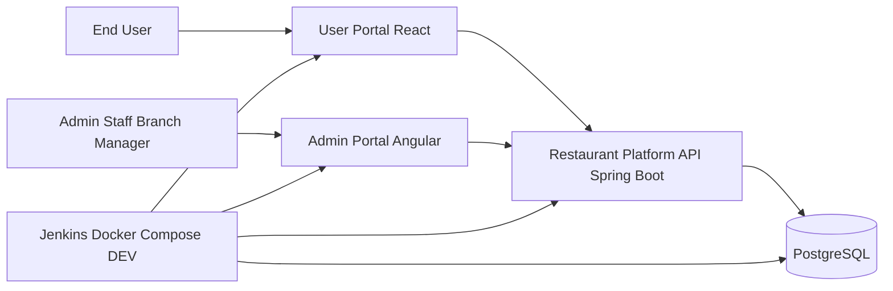
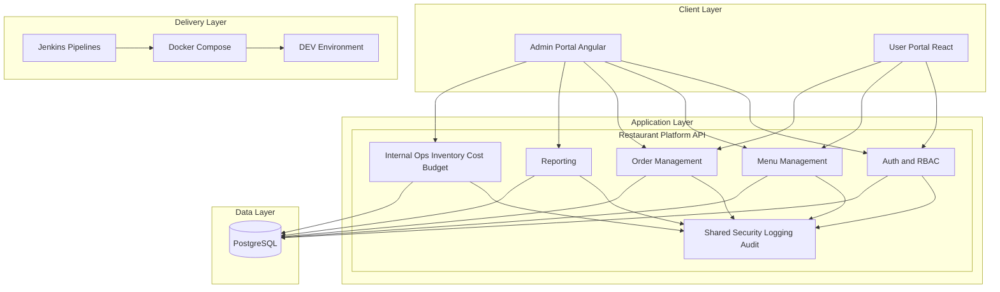

# Architecture

## Context Diagram

## System Architecture
### High-Level Architecture (MVP)

### Architecture Pattern
- MVP uses a modular monolith pattern in backend API.
- Domain boundaries are separated logically from day one.
- Public and internal concerns are separated by API route group and role policy.
- This pattern minimizes early complexity and preserves a clean scale-up path.

## FE
### Admin Portal (Angular)
- Primary modules:
  - Authentication
  - Dashboard
  - Menu Management
  - Order Operations
- Internal-only scope is exposed only in admin portal.
- Desktop-first layout for operational efficiency.

### User Portal (React)
- Primary modules:
  - Registration and Login
  - Product Catalog
  - Product Detail
  - Dine-in Order
  - Order Tracking
- Public and user-scoped experiences only.
- Mobile-first layout for in-store usage.

## BE
### Core Backend Structure (Spring Boot)
- auth module
- menu module
- order module
- reporting module
- internal-ops module
  - inventory
  - cost
  - budget
- shared module
  - security
  - exception
  - response
  - logging
  - audit

### API Boundary
- Public and user-scoped endpoints:
  - `/api/v1/*`
- Internal admin endpoints:
  - `/api/v1/admin/*`
- Internal modules inventory/cost/budget are Admin/Staff-only by RBAC policy.

### Data Ownership
- Menu domain owns menu data lifecycle.
- Order domain owns order lifecycle and status transitions.
- Reporting reads from transactional and financial records.
- Internal ops owns inventory, cost, and budget records.

## Integration
### MVP Integrations
- Admin Portal -> Internal Admin API routes.
- User Portal -> Public/User API routes.
- Backend API -> PostgreSQL.
- Backend API -> logging and audit trail.
- Jenkins pipelines -> build/test/deploy to DEV.

### Planned Future Integrations
- Dedicated auth service.
- API gateway service.
- Notification service.
- Event-driven messaging for decoupled module interactions.

## Security
### Authentication and Authorization
- Token-based authentication (JWT-compatible flow).
- Role-based access control for Admin, Staff, and End User.
- Unauthorized internal route access returns 403.

### Internal Boundary Rules
- Inventory/cost/budget functions are internal-only.
- End users cannot access internal admin APIs or screens.
- Sensitive actions must be logged and auditable.

### Security Controls
- Route-level policy enforcement.
- Input validation at API boundaries.
- Secure credential handling and password hashing.

## Deployment View
- DEV baseline uses containerized deployment with Docker Compose.
- Deployable units:
  - Admin FE container
  - User FE container
  - API container
  - PostgreSQL container
- Jenkins pipeline manages build, validation, and deployment flow to DEV.

## Scale-up Strategy
- Start with modular monolith for faster MVP delivery.
- Preserve extraction boundaries to split into services later.
- Candidate future extractions:
  - auth service
  - notification service
  - reporting service
  - inventory/cost service
- Split only when justified by load, release cadence, team ownership, or security boundary needs.

## Architecture Decisions
- Use modular monolith first, not full microservices at MVP.
- Separate repositories by responsibility.
- Separate public routes from internal routes.
- Keep inventory/cost/budget internal-only.
- Use PostgreSQL as primary transactional data store for MVP.
