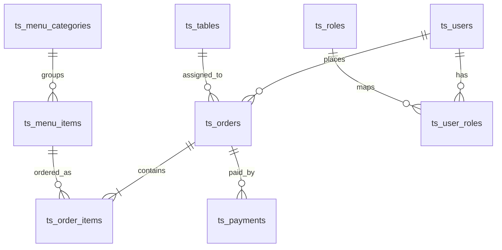

# Database Design

## ERD
### Naming Conventions (Bắt buộc)
- Tất cả khóa chính toàn hệ thống sử dụng kiểu `bigint`.
- Tất cả khóa ngoại tham chiếu đến PK cũng sử dụng kiểu `bigint`.
- Tất cả bảng bắt buộc có tiền tố `ts_` (ví dụ: `ts_menu_items`).
- Tên bảng dùng `snake_case`, số nhiều khi phù hợp ngữ nghĩa.
- Tên cột dùng `snake_case`.

### Core Entities (MVP)
- `ts_users`
- `ts_roles`
- `ts_user_roles`
- `ts_menu_categories`
- `ts_menu_items`
- `ts_tables`
- `ts_orders`
- `ts_order_items`
- `ts_payments`
- `ts_inventory_items`
- `ts_inventory_transactions`
- `ts_expense_records`

### Relationship Overview
- `ts_orders.user_id` -> `ts_users.id`
- `ts_orders.table_id` -> `ts_tables.id`
- `ts_order_items.order_id` -> `ts_orders.id`
- `ts_order_items.menu_item_id` -> `ts_menu_items.id`
- `ts_menu_items.category_id` -> `ts_menu_categories.id`
- `ts_payments.order_id` -> `ts_orders.id`
- `ts_user_roles.user_id` -> `ts_users.id`
- `ts_user_roles.role_id` -> `ts_roles.id`

## Tables

### ts_menu_items
| Column | Type | Constraint | Note |
|---|---|---|---|
| id | bigint | PK | Primary key toàn hệ |
| category_id | bigint | FK -> ts_menu_categories.id | Nhóm món ăn |
| name | varchar(150) | NOT NULL | Tên món |
| price | numeric(12,2) | NOT NULL | Giá bán |
| image_url | varchar(500) | NULL | Ảnh món |
| is_active | boolean | NOT NULL DEFAULT true | Trạng thái hiển thị |
| created_at | timestamptz | NOT NULL DEFAULT now() | Thời điểm tạo |
| updated_at | timestamptz | NOT NULL DEFAULT now() | Thời điểm cập nhật |

### ts_orders
| Column | Type | Constraint | Note |
|---|---|---|---|
| id | bigint | PK | Primary key toàn hệ |
| user_id | bigint | FK -> ts_users.id | Người đặt |
| table_id | bigint | FK -> ts_tables.id | Bàn phục vụ |
| order_code | varchar(50) | UNIQUE NOT NULL | Mã đơn |
| status | varchar(30) | NOT NULL | NEW/CONFIRMED/SERVED/CLOSED/CANCELLED |
| subtotal_amount | numeric(12,2) | NOT NULL DEFAULT 0 | Tạm tính |
| discount_amount | numeric(12,2) | NOT NULL DEFAULT 0 | Giảm giá |
| total_amount | numeric(12,2) | NOT NULL DEFAULT 0 | Tổng tiền |
| created_at | timestamptz | NOT NULL DEFAULT now() | Thời điểm tạo |
| updated_at | timestamptz | NOT NULL DEFAULT now() | Thời điểm cập nhật |

### ts_order_items
| Column | Type | Constraint | Note |
|---|---|---|---|
| id | bigint | PK | Primary key toàn hệ |
| order_id | bigint | FK -> ts_orders.id | Thuộc đơn hàng |
| menu_item_id | bigint | FK -> ts_menu_items.id | Món được chọn |
| quantity | integer | NOT NULL | Số lượng |
| unit_price | numeric(12,2) | NOT NULL | Đơn giá tại thời điểm đặt |
| line_total | numeric(12,2) | NOT NULL | Thành tiền dòng |
| note | varchar(255) | NULL | Ghi chú |

### ts_inventory_items
| Column | Type | Constraint | Note |
|---|---|---|---|
| id | bigint | PK | Primary key toàn hệ |
| code | varchar(50) | UNIQUE NOT NULL | Mã nguyên liệu/vật tư |
| name | varchar(150) | NOT NULL | Tên mặt hàng |
| unit | varchar(30) | NOT NULL | Đơn vị tính |
| quantity_on_hand | numeric(14,3) | NOT NULL DEFAULT 0 | Tồn kho hiện tại |
| min_threshold | numeric(14,3) | NOT NULL DEFAULT 0 | Mức cảnh báo |
| updated_at | timestamptz | NOT NULL DEFAULT now() | Cập nhật gần nhất |

## Indexes

### Recommended Indexes
- `idx_ts_menu_items_category_id` on `ts_menu_items(category_id)`
- `idx_ts_menu_items_is_active` on `ts_menu_items(is_active)`
- `idx_ts_orders_user_id_created_at` on `ts_orders(user_id, created_at desc)`
- `idx_ts_orders_status_created_at` on `ts_orders(status, created_at desc)`
- `idx_ts_order_items_order_id` on `ts_order_items(order_id)`
- `idx_ts_inventory_transactions_item_id_created_at` on `ts_inventory_transactions(inventory_item_id, created_at desc)`

### Uniqueness Constraints
- `uq_ts_orders_order_code` on `ts_orders(order_code)`
- `uq_ts_roles_code` on `ts_roles(code)`
- `uq_ts_inventory_items_code` on `ts_inventory_items(code)`

## Data Retention

### Transactional Data
- `ts_orders`, `ts_order_items`, `ts_payments`: giữ tối thiểu 5 năm để phục vụ đối soát.
- Không hard-delete giao dịch sau khi phát sinh; dùng trạng thái `CANCELLED` hoặc `VOID` khi cần.

### Internal Operation Data
- `ts_inventory_transactions`, `ts_expense_records`: giữ tối thiểu 3 năm.

### Audit and Soft Delete
- Khuyến nghị bổ sung các cột `created_by`, `updated_by` kiểu `bigint` cho bảng nghiệp vụ quan trọng.
- Nếu cần xóa mềm, dùng `deleted_at timestamptz NULL` thay vì xóa vật lý.

### Partitioning (Scale-up)
- Khi lưu lượng tăng, ưu tiên partition theo tháng cho `ts_orders` và `ts_inventory_transactions`.
- Giữ nguyên quy tắc PK/FK `bigint` và tiền tố bảng `ts_` kể cả khi tách partition.
