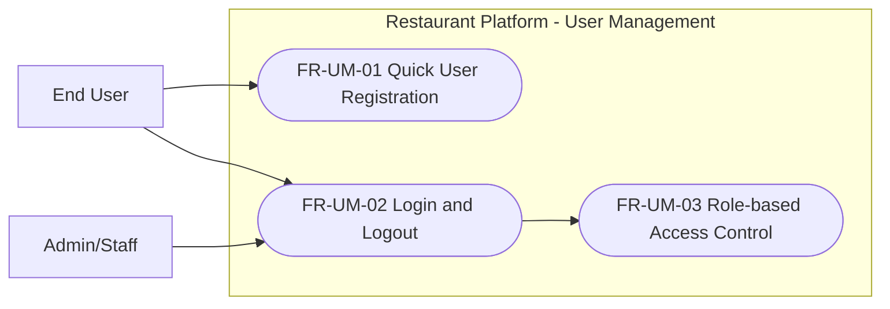
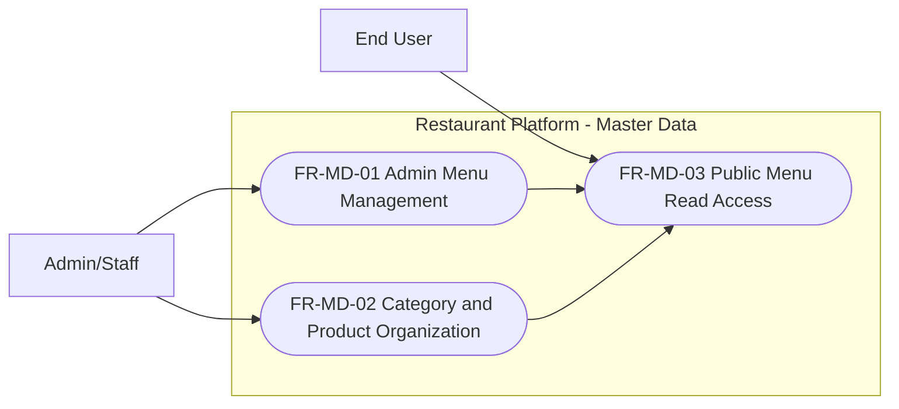
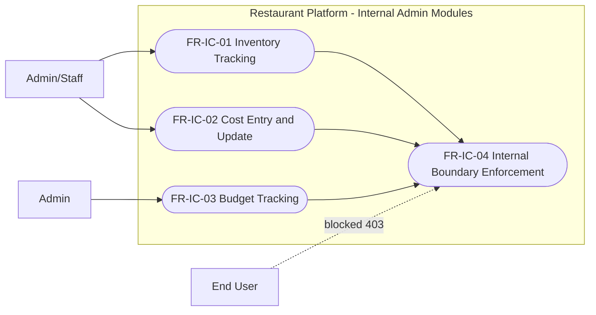
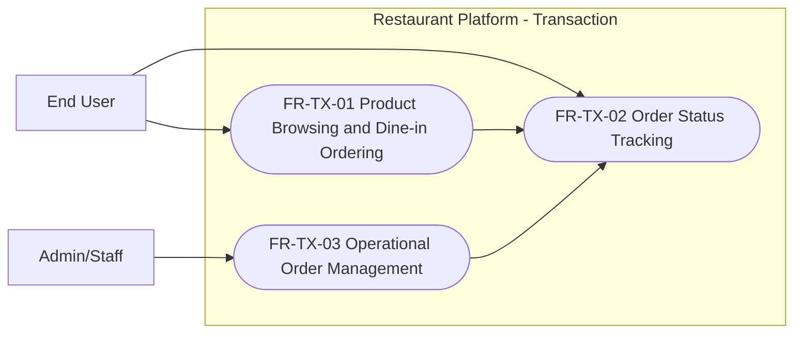
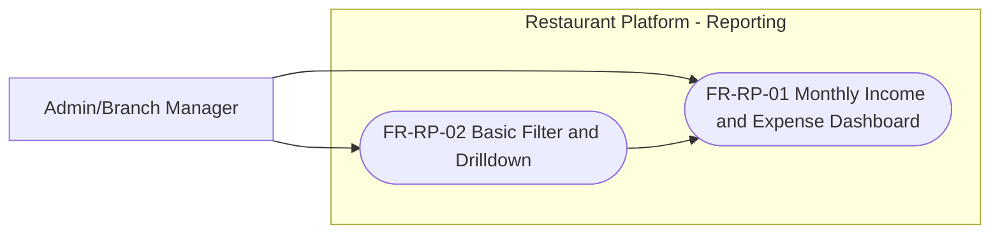
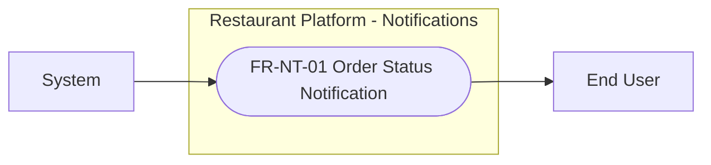
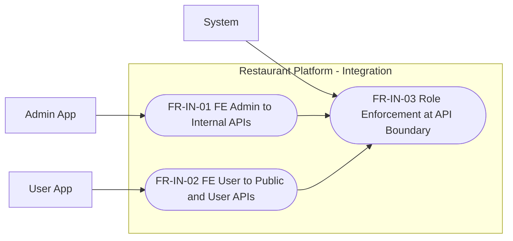

# Functional Requirement

## Modules

### User Management
- FR-UM-01 - Quick User Registration (MVP)
	- Description: End user can create an account with a minimal registration flow.
	- Actor: End User
	- Preconditions: User is not authenticated.
	- Process Flow: Open registration form, submit required fields, validate, create account.
	- Expected Result: Account is created and can be used for login.
- FR-UM-02 - Login and Logout (MVP)
	- Description: User and admin can authenticate and end sessions.
	- Actor: End User, Admin, Staff
	- Preconditions: Account exists and is active.
	- Process Flow: Submit credentials, receive token/session, logout when needed.
	- Expected Result: Authenticated access by role, secure logout flow.
- FR-UM-03 - Role-based Access Control (MVP)
	- Description: System enforces role-based permission checks.
	- Actor: System
	- Preconditions: Authenticated request with valid role claim.
	- Process Flow: Validate token, evaluate role against endpoint permission.
	- Expected Result: Unauthorized roles are blocked with proper error.

### Master Data
- FR-MD-01 - Admin Menu Management (MVP)
	- Description: Admin manages menu items including name, image, price, and availability.
	- Actor: Admin, Staff
	- Preconditions: Actor has admin or staff permission.
	- Process Flow: Create/update/archive menu item, upload image, adjust price.
	- Expected Result: Menu data is updated and visible based on status rules.
- FR-MD-02 - Category and Product Organization (MVP)
	- Description: Admin can organize menu by categories for consistent display.
	- Actor: Admin, Staff
	- Preconditions: Menu management access granted.
	- Process Flow: Create categories, assign menu items, reorder display.
	- Expected Result: Product listing is structured and easy to browse.
- FR-MD-03 - Public Menu Read Access (MVP)
	- Description: Customer-facing app can read active menu items only.
	- Actor: End User
	- Preconditions: Menu items are marked active.
	- Process Flow: Request menu list/detail from public endpoints.
	- Expected Result: User sees only active products approved for sale.

### Inventory and Cost Management (Internal Admin)
- FR-IC-01 - Inventory Tracking (Phase 1.1)
	- Description: Admin tracks inventory for ingredients and beverages.
	- Actor: Admin, Staff
	- Preconditions: Internal admin permission.
	- Process Flow: Create stock item, update quantity, record adjustments.
	- Expected Result: Inventory records are available for internal operations.
- FR-IC-02 - Cost Entry and Update (Phase 1.1)
	- Description: Admin records and updates ingredient/supply cost entries.
	- Actor: Admin, Staff
	- Preconditions: Internal admin permission.
	- Process Flow: Enter cost transaction, validate fields, save and audit.
	- Expected Result: Cost data is stored with traceability.
- FR-IC-03 - Budget Tracking (Phase 1.1)
	- Description: Admin manages income and expense budget plans.
	- Actor: Admin
	- Preconditions: Admin role.
	- Process Flow: Create/update budget periods and values, review changes.
	- Expected Result: Budget data supports monthly dashboard views.
- FR-IC-04 - Internal Boundary Enforcement (MVP)
	- Description: Inventory/cost/budget functions are internal-only.
	- Actor: System
	- Preconditions: Request targets internal endpoint.
	- Process Flow: Validate role and route prefix policy.
	- Expected Result: End-user roles cannot access internal admin endpoints.

### Transaction
- FR-TX-01 - Product Browsing and Dine-in Ordering (MVP)
	- Description: User browses products and creates dine-in order.
	- Actor: End User
	- Preconditions: Product is active and order session is valid.
	- Process Flow: Browse product list, select items, submit order.
	- Expected Result: Order is created successfully with initial status.
- FR-TX-02 - Order Status Tracking (MVP)
	- Description: User can view order status for owned orders.
	- Actor: End User
	- Preconditions: User is authenticated and owns the order.
	- Process Flow: Request order detail/status by order id.
	- Expected Result: User can track order lifecycle state.
- FR-TX-03 - Operational Order Management (MVP)
	- Description: Admin/staff can view and update order status for operations.
	- Actor: Admin, Staff
	- Preconditions: Internal role and valid order state transition.
	- Process Flow: Open order queue, update status, validate transition rule.
	- Expected Result: Order status updates remain consistent and auditable.

### Reporting
- FR-RP-01 - Monthly Income/Expense Dashboard (MVP)
	- Description: Admin can view monthly financial overview dashboard.
	- Actor: Admin, Branch Manager
	- Preconditions: Financial data available for selected month.
	- Process Flow: Select month/branch filter, aggregate and render metrics.
	- Expected Result: Dashboard displays trusted monthly income/expense data.
- FR-RP-02 - Basic Filter and Drilldown (Phase 1.1)
	- Description: Admin can filter reports by period and branch.
	- Actor: Admin, Branch Manager
	- Preconditions: Reporting dataset exists.
	- Process Flow: Apply filters, refresh chart/table components.
	- Expected Result: Reports reflect selected scope accurately.

### Notifications
- FR-NT-01 - Order Status Notification (Phase 1.1)
	- Description: User receives basic status updates for orders.
	- Actor: End User, System
	- Preconditions: Valid order event emitted.
	- Process Flow: Trigger event, map user target, deliver in-app notification.
	- Expected Result: User sees status change notification.

### Integration Requirements
- FR-IN-01 - FE Admin to Internal APIs (MVP)
	- Description: Admin frontend consumes internal admin API groups.
	- Actor: Admin App
	- Preconditions: Authenticated admin session.
	- Process Flow: Call admin endpoints with role token and guard checks.
	- Expected Result: Admin features work via internal endpoints.
- FR-IN-02 - FE User to Public/User APIs (MVP)
	- Description: User frontend consumes public and user-scoped API groups only.
	- Actor: User App
	- Preconditions: User session rules satisfied.
	- Process Flow: Call public menu and user order endpoints.
	- Expected Result: User features operate without internal API access.
- FR-IN-03 - Role Enforcement at API Boundary (MVP)
	- Description: API layer enforces role and exposure policy.
	- Actor: System
	- Preconditions: Request arrives at gateway/API boundary.
	- Process Flow: Validate route group, validate role, return status code.
	- Expected Result: Unauthorized internal access is rejected with 403.

## Acceptance Criteria
- AC-01: User can register, login, browse products, and place dine-in order in MVP.
- AC-02: Admin can manage menu item image, price, and product details in MVP.
- AC-03: Admin can view monthly income/expense dashboard in MVP.
- AC-04: End-user role cannot access inventory/cost/budget endpoints; system returns 403.
- AC-05: Order status transitions follow defined lifecycle and invalid transitions are blocked.
- AC-06: Functional flows are testable in DEV environment via FE and BE integration.

## MVP Scope Mapping
- Included in MVP
	- FR-UM-01, FR-UM-02, FR-UM-03
	- FR-MD-01, FR-MD-02, FR-MD-03
	- FR-TX-01, FR-TX-02, FR-TX-03
	- FR-RP-01
	- FR-IN-01, FR-IN-02, FR-IN-03
	- FR-IC-04
- Planned after MVP (Phase 1.1+)
	- FR-IC-01, FR-IC-02, FR-IC-03
	- FR-RP-02
	- FR-NT-01

## Out of Scope for MVP
- Full table reservation workflow.
- Multi-channel notification orchestration.
- Advanced analytics and AI recommendation features.
- Multi-tenant functional segregation.

## Use Case Diagrams

### UC-UM - User Management

### UC-MD - Master Data Management

### UC-IC - Inventory and Cost (Internal)

### UC-TX - Transaction Management

### UC-RP - Reporting

### UC-NT - Notifications

### UC-IN - Integration Requirements

