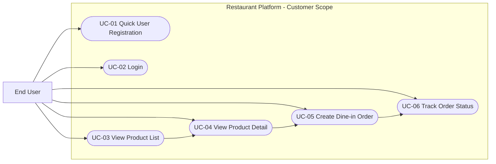
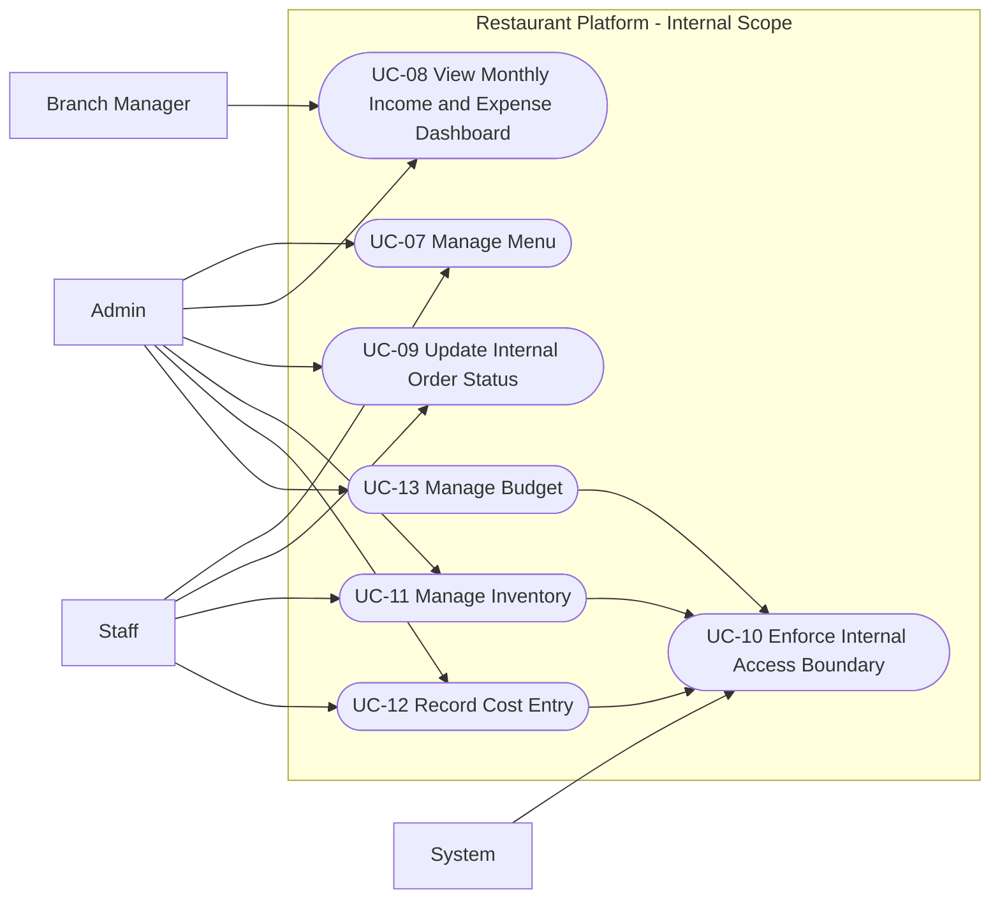

# Use Cases

## Actors
- End User: Customer using the application for browsing products and placing dine-in orders.
- Admin: Internal operator with full access to protected business functions.
- Staff: Internal user supporting menu updates and order operations.
- Branch Manager: Internal user responsible for branch-level reporting visibility.
- System: Platform components enforcing permissions, processing requests, and emitting operational events.

## Use Case Diagram Overview

### Customer-facing Use Cases

### Internal Admin Use Cases

## Main Use Cases (MVP)

### UC-01 - Quick User Registration
- Goal: Allow customer to create an account quickly for app usage.
- Primary Actor: End User
- Supporting Actors: System
- Preconditions:
  - User is not authenticated.
- Trigger:
  - User chooses the registration option.
- Main Flow:
  1. User opens the registration form.
  2. User enters required account information.
  3. System validates input.
  4. System creates the account.
  5. System confirms successful registration.
- Alternative Flow:
  1. Input data is invalid.
  2. Account identifier already exists.
- Postconditions:
  - New user account is stored and available for login.
- Business Rules:
  - Registration flow should remain simple for MVP.
- Mapping:
  - FR-UM-01

### UC-02 - Login
- Goal: Allow user or internal operator to authenticate and enter the system.
- Primary Actor: End User, Admin, Staff
- Supporting Actors: System
- Preconditions:
  - Account exists and is active.
- Trigger:
  - Actor submits login credentials.
- Main Flow:
  1. Actor enters credentials.
  2. System validates credentials.
  3. System issues authenticated session or token.
  4. Actor gains access according to role.
- Alternative Flow:
  1. Invalid credentials are submitted.
  2. Account is inactive.
- Postconditions:
  - Authenticated session is established.
- Business Rules:
  - Access rights depend on assigned role.
- Mapping:
  - FR-UM-02
  - FR-UM-03

### UC-03 - View Product List
- Goal: Let customer browse active products available for ordering.
- Primary Actor: End User
- Supporting Actors: System
- Preconditions:
  - Active menu items exist.
- Trigger:
  - User opens the menu page.
- Main Flow:
  1. User requests product list.
  2. System retrieves active menu items.
  3. System returns visible products.
- Alternative Flow:
  1. No active products exist.
- Postconditions:
  - User sees the current public product list.
- Business Rules:
  - Only active items may appear in public scope.
- Mapping:
  - FR-MD-03
  - FR-TX-01

### UC-04 - View Product Detail
- Goal: Let customer inspect product information before ordering.
- Primary Actor: End User
- Supporting Actors: System
- Preconditions:
  - Product exists and is active.
- Trigger:
  - User selects a product from the list.
- Main Flow:
  1. User opens product detail.
  2. System loads name, image, price, and detail information.
  3. User reviews product information.
- Alternative Flow:
  1. Product is no longer active.
  2. Product does not exist.
- Postconditions:
  - User is able to decide whether to add product to order.
- Business Rules:
  - Public detail view follows menu visibility rules.
- Mapping:
  - FR-MD-03

### UC-05 - Create Dine-in Order
- Goal: Allow customer to create an on-site order from available products.
- Primary Actor: End User
- Supporting Actors: System
- Preconditions:
  - User is authenticated.
  - Selected products are active.
- Trigger:
  - User submits the order.
- Main Flow:
  1. User selects products and quantities.
  2. User confirms the order.
  3. System validates order data.
  4. System creates the order with initial status.
  5. System returns order confirmation.
- Alternative Flow:
  1. Product is unavailable.
  2. Order payload is invalid.
  3. User session is missing or expired.
- Postconditions:
  - Order is stored and ready for internal processing.
- Business Rules:
  - Order must start with a valid initial lifecycle state.
- Mapping:
  - FR-TX-01

### UC-06 - Track Order Status
- Goal: Allow customer to view status of their own order.
- Primary Actor: End User
- Supporting Actors: System
- Preconditions:
  - User is authenticated.
  - Order exists and belongs to the user.
- Trigger:
  - User requests order status.
- Main Flow:
  1. User opens order detail or tracking screen.
  2. System verifies order ownership.
  3. System returns current order status.
- Alternative Flow:
  1. Order does not belong to the user.
  2. Order is not found.
- Postconditions:
  - User sees latest lifecycle state for owned order.
- Business Rules:
  - Users can access only their own order information.
- Mapping:
  - FR-TX-02

### UC-07 - Manage Menu
- Goal: Allow internal operators to create and maintain menu data.
- Primary Actor: Admin, Staff
- Supporting Actors: System
- Preconditions:
  - Actor has internal permission.
- Trigger:
  - Actor opens menu management module.
- Main Flow:
  1. Actor creates or selects a menu item.
  2. Actor enters or updates name, image, price, and status.
  3. System validates the input.
  4. System saves the menu change.
  5. Public product visibility updates according to status.
- Alternative Flow:
  1. Required data is missing.
  2. Uploaded image is invalid.
  3. Actor lacks permission.
- Postconditions:
  - Menu data is updated for internal and public usage.
- Business Rules:
  - Sensitive price changes should be auditable.
- Mapping:
  - FR-MD-01
  - FR-MD-02

### UC-08 - View Monthly Income and Expense Dashboard
- Goal: Provide internal financial visibility by month.
- Primary Actor: Admin, Branch Manager
- Supporting Actors: System
- Preconditions:
  - Dashboard data exists for the selected period.
- Trigger:
  - Actor opens dashboard screen.
- Main Flow:
  1. Actor selects month or branch scope.
  2. System aggregates financial data.
  3. System renders dashboard metrics.
- Alternative Flow:
  1. No data exists for the requested period.
- Postconditions:
  - Actor can review monthly income and expense view.
- Business Rules:
  - Dashboard visibility is internal-only.
- Mapping:
  - FR-RP-01

### UC-09 - Update Internal Order Status
- Goal: Allow internal staff to move orders through operational states.
- Primary Actor: Admin, Staff
- Supporting Actors: System
- Preconditions:
  - Actor has internal role.
  - Order exists.
- Trigger:
  - Actor chooses to change order status.
- Main Flow:
  1. Actor opens operational order queue.
  2. Actor selects an order.
  3. Actor chooses next valid status.
  4. System validates state transition.
  5. System saves updated order status.
- Alternative Flow:
  1. Requested transition is invalid.
  2. Actor lacks permission.
- Postconditions:
  - Order reflects updated operational state.
- Business Rules:
  - Invalid status transitions must be rejected.
  - Sensitive internal changes should be auditable.
- Mapping:
  - FR-TX-03

### UC-10 - Enforce Internal Access Boundary
- Goal: Prevent end-user access to protected internal modules.
- Primary Actor: System
- Supporting Actors: End User
- Preconditions:
  - Request targets internal route group.
- Trigger:
  - End-user role or unauthorized actor sends request to protected endpoint.
- Main Flow:
  1. System inspects endpoint group.
  2. System validates role and access policy.
  3. System blocks unauthorized access.
  4. System returns 403 response.
- Alternative Flow:
  1. Authorized internal role accesses the protected endpoint successfully.
- Postconditions:
  - Internal modules remain protected from public access.
- Business Rules:
  - Inventory, cost, and budget modules are internal Admin-only capabilities.
- Mapping:
  - FR-IC-04
  - FR-IN-03

## Deferred Use Cases (Phase 1.1+)

### UC-11 - Manage Inventory
- Scope: Internal-only inventory operations for ingredients and beverages.
- Mapping:
  - FR-IC-01

### UC-12 - Record Cost Entry
- Scope: Internal-only cost transaction creation and maintenance.
- Mapping:
  - FR-IC-02

### UC-13 - Manage Budget
- Scope: Internal-only budget planning and updates.
- Mapping:
  - FR-IC-03

### UC-14 - Table Reservation
- Scope: User-facing reservation capability after MVP.
- Mapping:
  - Future scope from project vision.

### UC-15 - Order Status Notification
- Scope: Basic notification flow for order lifecycle events.
- Mapping:
  - FR-NT-01

## Alternative Flows Summary
- Invalid authentication or authorization returns access denial.
- Public users cannot access internal inventory, cost, or budget features.
- Invalid order state transition is rejected.
- Missing or invalid input blocks processing until corrected.
- Missing business data may result in empty state rather than system failure.
